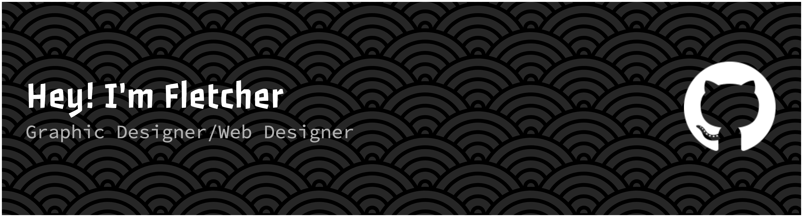

I really enjoy learning new things and putting my newfound skills to the test by tinkering with tech. Whether it’s experimenting with new tools, figuring out how something works, or building little side projects, I get a lot of satisfaction from the process.

I just built a completely interactive portfolio that feels and appears identical to Windows 10 — check out fletcherholt.xyz. I didn't simply want to create another typical scroll-and-read site, so I had it operate in the same manner we utilize a desktop: click-to-open icons, drag-to-move windows, and a playful, OS-imitating interface.

What was most exciting about this project was that I was designing and learning at the same time. I made it on Next.js and TypeScript, and it challenged me to improve my skills in front-end development and systematic coding. There were moments where I'd hit a roadblock — making state management for animating windows smooth, or taking the animations to the level where it didn't feel jerky — but each obstacle was a learning experience. When I finished, it wasn't just a portfolio that I'd built, but a reflection of how I'd developed as a developer.
