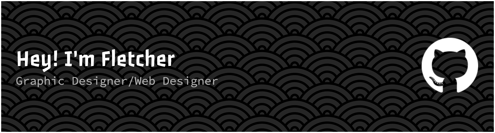

# Hey, I'm Fletcher

I'm a young developer who builds things because I enjoy it, and because I like making stuff that actually helps people. I spend most of my time figuring out how things work and then turning that into tools, apps, and side projects I'd want to use myself.

I care about the small details: software that feels good to use, runs reliably, and solves a real problem without getting in the way.

## What I'm working on

My latest project is an interactive portfolio that works like a Windows 10 desktop, open icons, drag windows around, all of it. Instead of another scroll-and-read site, I wanted something you actually use. Built with Next.js and TypeScript.

[fletcherholt.xyz](https://fletcherholt.xyz)

## How I work

I'm mostly self-taught and self-driven. I pick something I don't know how to do yet, then keep building until I do. Most of what you'll find here started as "I wonder if I can..." and grew into a real project.
